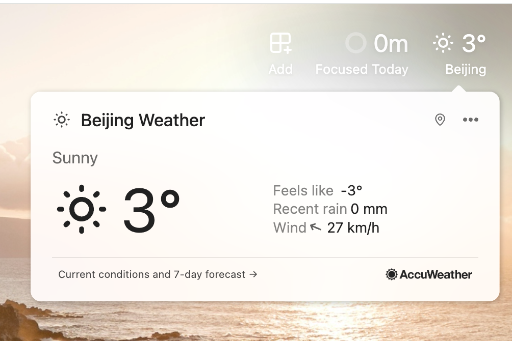

# Dawn

> Occupy your beauty, redefine your start.

这是一个很棒的扩展。


## Quick Start

1. Install dependencies:

```bash
npm install
```

2. Start development server:

```bash
npm run dev
```

3. Open Chrome and navigate to `chrome://extensions/`, enable "Developer mode", and load the unpacked extension from the `dist` directory.

4. Build for production:

```bash
npm run build
```

## Project Structure

- `manifest.config.ts` - Chrome extension manifest configuration

## Show
